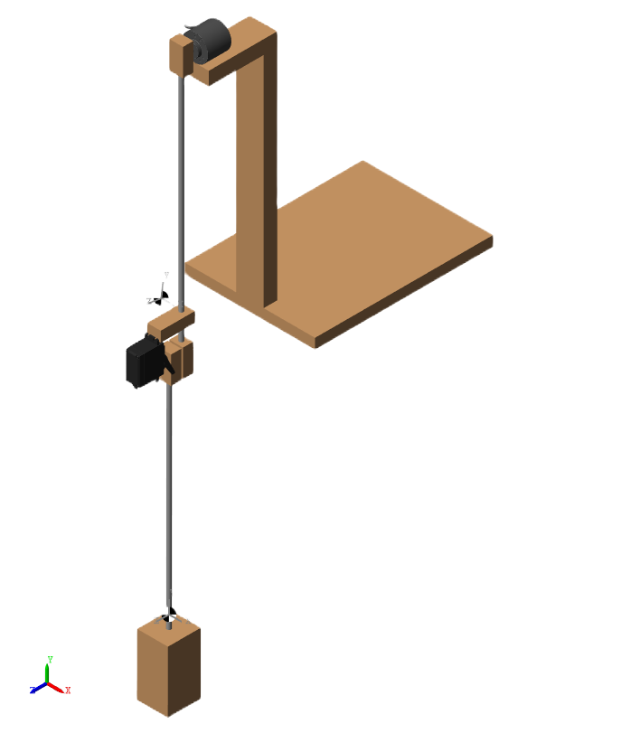
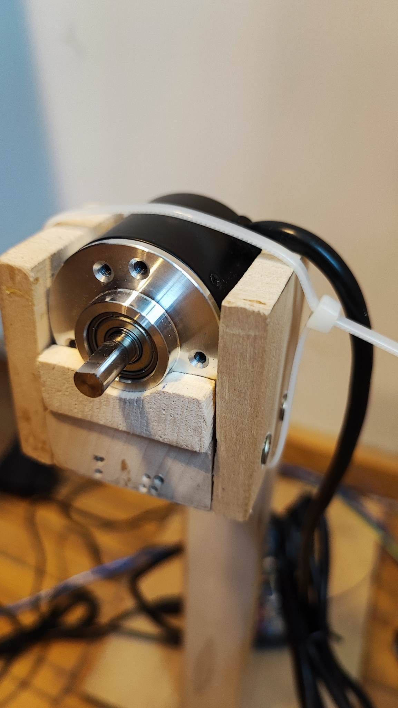
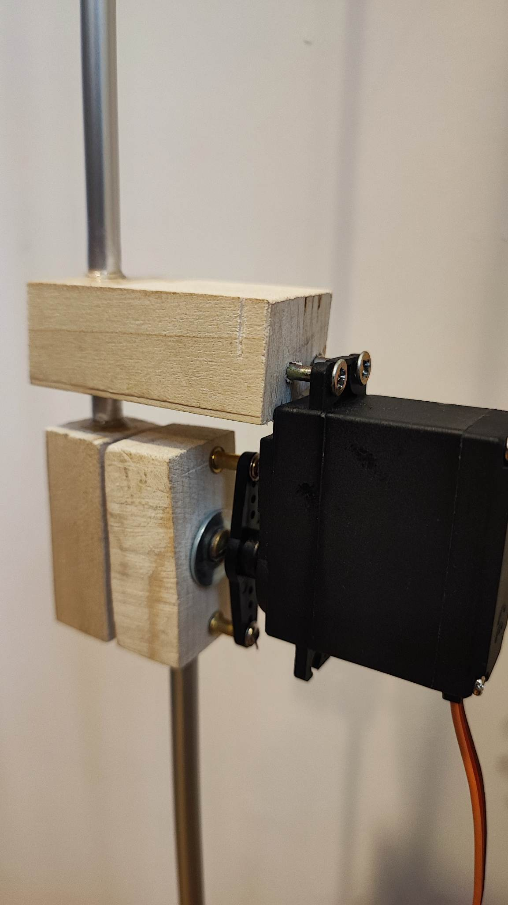

# Acrobot Simulation and Implementation

This repository contains the code and resources for my university thesis, which focused on the simulation and implementation of an **Acrobot** system. The Acrobot is a two-link underactuated robotic arm, commonly used in control theory research. This project bridges theoretical simulations with practical hardware implementation, showcasing the swing-up and stabilization of the Acrobot using Linear-Quadratic Regulator (LQR) control.

---

## 📖 Table of Contents

- [Project Structure](#-project-structure)
- [Features](#️-features)
- [Screenshots and Visuals](#-screenshots-and-visuals)
- [Getting Started](#-getting-started)
- [Results](#-results)
- [Further Details](#-further-details)

---

## 📂 Project Structure

### 1. **Simulations**
   - **Acrobot Swing-Up and Balance Simulation**:
     - A detailed MATLAB/Simulink simulation of the Acrobot, featuring:
       - The ability to modify system attributes, such as:
         - Adding noise to the system to test robustness.
         - Observing simulated data versus simulated encoder data and their differences.
       - A DC motor model implemented in the simulation.
       - Customizable starting positions for the Acrobot.
     - Parameters for the simulation are derived from real-world measurements, but they can be adjusted as needed.

   - **Theoretical Double Pendulum Simulation**:
     - Simulates a theoretical double pendulum to explore its chaotic dynamics and provide insights into the physics and mathematics of such systems.

### 2. **Arduino Implementations**
   - **Encoder Computing**:
     - Reads encoder values to measure the angles of the Acrobot's links in real-time.
   - **Servo Motor Control**:
     - Controls the torque applied to the Acrobot's actuator using a servo motor (replacing the DC motor used in the simulation).
   - **Combined Computing**:
     - Integrates encoder readings and motor control for a closed-loop system in hardware.

---

## 🛠️ Features

- **Simulink Models**: A modular and interactive simulation environment for testing and refining the Acrobot control system.
- **MATLAB Scripts**: Key functionalities include LQR design, energy calculations, and visualization.
- **Hardware Control**:
  - Arduino code for real-time encoder data processing and servo motor actuation.
- **Customization**:
  - Modify system parameters (e.g., masses, lengths, and moments of inertia) based on hardware measurements.
  - Test different starting positions for the Acrobot.

---

## 📸 Screenshots and Visuals

### Simulink Model

### Implementation Setup

---

## 🚀 Getting Started

To run the simulation, execute the `main.m` script in MATLAB. This will:
1. Load the system parameters derived from real-world measurements.
2. Linearize the system around the operating point.
3. Perform LQR calculations.
4. Simulate the Acrobot swing-up and balancing behavior in Simulink.
5. Generate visualization plots for analysis.

---

## 📊 Results

### Features of the Simulation
- Observe both ideal simulated data and noisy encoder-like simulated data to analyze differences.
- Test and tune the system under various starting conditions and parameters.

### Hardware Validation
- Parameters in the simulation are based on real-world measurements to ensure accuracy.
- While the simulation uses a DC motor model, the implementation uses a servo motor for torque control.
- The implementation closely follows the behavior predicted by the simulation.

---

## 📜 Further Details

For an in-depth explanation of the project, including theoretical background, implementation details, and results, refer to the thesis document: **`Allamvizsga_szakdolgozat.pdf`**.
